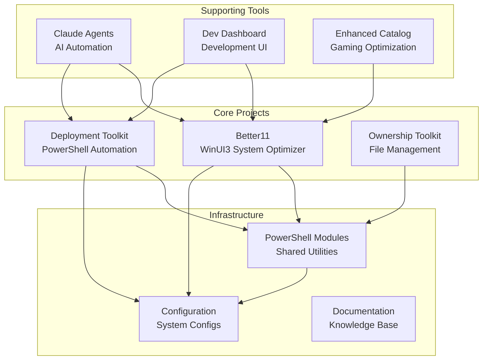
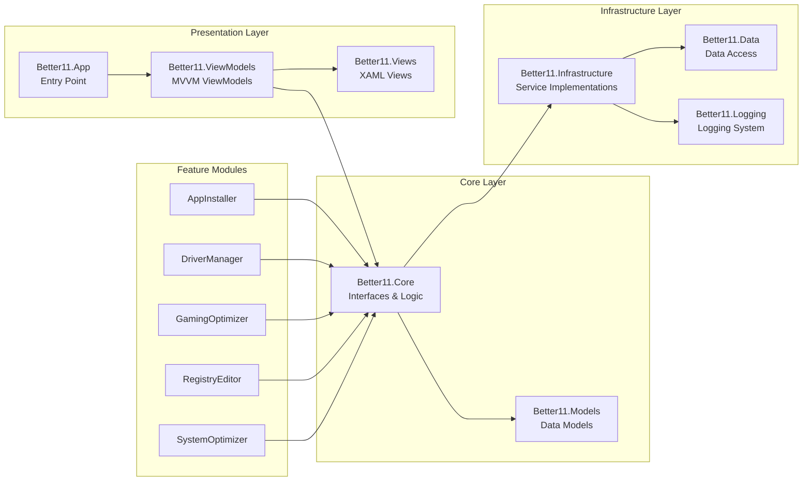
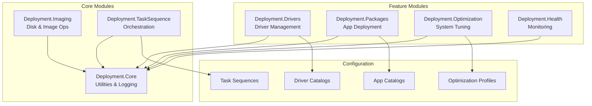
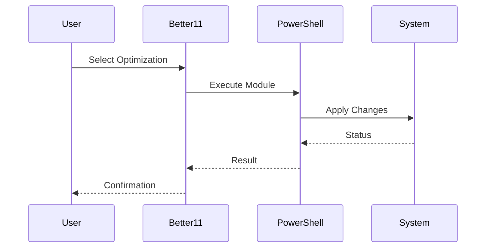
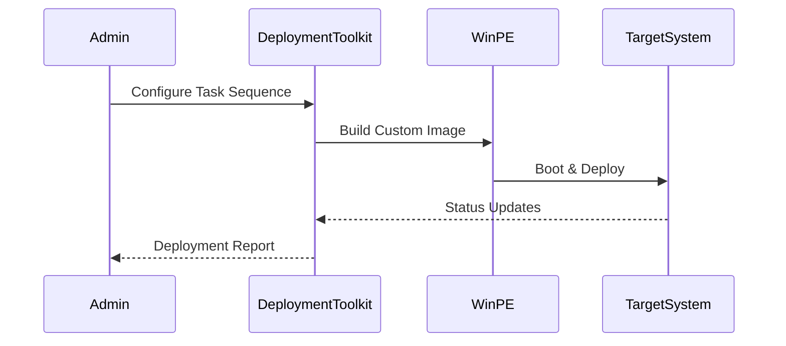

# Development Workspace Architecture

## System Overview

The Dev workspace is a comprehensive development environment containing multiple interconnected projects focused on Windows system optimization, deployment automation, and development tooling.



## Project Relationships

### Better11 (Main System Optimizer)
- **Location**: `projects/active/better11/`
- **Type**: C# WinUI3 Application
- **Purpose**: Windows 11 system optimization and management suite
- **Dependencies**: 
  - PowerShell modules for system operations
  - Configuration files in `Config/`
- **Related Projects**:
  - Enhanced Catalog (gaming optimization integration)
  - Ownership Toolkit (file permission management)

### Deployment Toolkit
- **Location**: `projects/active/deployment-toolkit/`
- **Type**: PowerShell Module Suite
- **Purpose**: Windows deployment automation, WinPE customization, system imaging
- **Dependencies**:
  - PowerShell core modules
  - Configuration files for task sequences
- **Integration Points**:
  - Better11 (deployment of optimized systems)
  - Claude Agents (automated deployment workflows)

### Ownership Toolkit
- **Location**: `projects/active/ownership-toolkit/`
- **Type**: File Management Utility
- **Purpose**: Advanced file ownership and permission management
- **Integration**: Can be integrated into Better11 as infrastructure utility

### Enhanced Catalog
- **Location**: `projects/active/enhanced-catalog/`
- **Type**: Gaming Optimization Module
- **Purpose**: Gaming-specific system optimizations
- **Integration**: Candidate for Better11.Modules.GamingOptimizer integration

### Claude Agents
- **Location**: `projects/active/claude-agents/`
- **Type**: AI Automation Framework
- **Purpose**: Automated workflows and intelligent task execution
- **Integration**: Orchestrates Better11 and Deployment Toolkit operations

### Dev Dashboard
- **Location**: `projects/active/dev-dashboard/`
- **Type**: Web-based Development UI
- **Purpose**: Centralized development monitoring and control
- **Technologies**: Web technologies (likely React/Node.js)

## Technology Stack

### C# / .NET Projects
- **Better11**: WinUI3, .NET 8+
- **Architecture**: MVVM pattern
- **UI Framework**: WinUI 3
- **Testing**: xUnit, MSTest

### PowerShell Projects
- **Deployment Toolkit**: PowerShell 5.1+ / PowerShell 7+
- **Module Structure**: PSM1 modules with manifest files
- **Testing**: Pester framework
- **Key Modules**:
  - Deployment.Core
  - Deployment.Imaging
  - Deployment.TaskSequence
  - Deployment.Drivers
  - Deployment.Packages

### Web Projects
- **Dev Dashboard**: JavaScript/TypeScript
- **Framework**: Likely React or Vue.js
- **Purpose**: Development monitoring and control interface

### Shared Infrastructure
- **PowerShell Modules**: 964+ modules in `PowerShell/Modules/`
- **Configuration**: JSON, YAML, XML configuration files
- **Documentation**: Markdown documentation system

## Module Architecture

### Better11 Module System



### Deployment Toolkit Architecture



## Data Flow

### System Optimization Flow


### Deployment Flow


## Design Patterns

### MVVM (Model-View-ViewModel)
- **Used in**: Better11 WinUI3 application
- **Benefits**: Separation of concerns, testability, data binding
- **Implementation**: ViewModels expose ICommand and INotifyPropertyChanged

### Dependency Injection
- **Used in**: Better11 infrastructure layer
- **Benefits**: Loose coupling, testability, flexibility
- **Container**: Microsoft.Extensions.DependencyInjection

### Module Pattern
- **Used in**: PowerShell Deployment Toolkit
- **Benefits**: Encapsulation, reusability, maintainability
- **Structure**: Each module is self-contained with manifest

### Repository Pattern
- **Used in**: Better11 data access layer
- **Benefits**: Abstraction of data access, testability
- **Implementation**: Generic repository with specific implementations

## Directory Structure

```
Dev/
├── projects/
│   ├── active/                      # Active development projects
│   │   ├── better11/               # Better11 WinUI3 app
│   │   ├── automation-suite/       # Automation components
│   │   ├── deployment-toolkit/     # PowerShell deployment
│   │   ├── claude-agents/          # AI automation
│   │   ├── dev-dashboard/          # Development UI
│   │   ├── ownership-toolkit/      # File management
│   │   └── enhanced-catalog/       # Gaming optimization
│   ├── archived/                   # Completed/inactive projects
│   └── templates/                  # Project templates
│
├── PowerShell/                      # Consolidated PowerShell
│   ├── Modules/                    # 964+ PowerShell modules
│   ├── Scripts/                    # Utility scripts
│   ├── Help/                       # Help documentation
│   └── archive/                    # Legacy files
│
├── Config/                          # Configuration files
│   ├── better11.release.json
│   ├── WinUtilsExport.json
│   └── golden-image.yml
│
├── docs/                            # Documentation
│   ├── WORKSPACE-REORGANIZATION.md
│   ├── ARCHITECTURE.md             # This file
│   ├── BACKLOG.md
│   ├── ROADMAP.md
│   ├── archive/                    # Historical docs
│   └── standards/                  # Development standards
│
├── modules/                         # Shared PowerShell modules
├── tools/                           # Development tools
├── scripts/                         # Organized scripts
├── src/                             # Source code organization
└── archive/                         # Archived directories
```

## Integration Points

### Better11 ↔ PowerShell Modules
- Better11 calls PowerShell modules for system operations
- Uses `System.Management.Automation` for PowerShell interop
- Async execution with progress reporting

### Deployment Toolkit ↔ Configuration
- Task sequences defined in YAML/JSON
- Driver catalogs reference external repositories
- App catalogs define installation packages

### Claude Agents ↔ All Projects
- Orchestrates workflows across projects
- Monitors project status
- Automates repetitive tasks

### Dev Dashboard ↔ Projects
- Displays project status and metrics
- Provides centralized control interface
- Real-time monitoring and alerts

## Security Considerations

- **Elevation**: Many operations require administrator privileges
- **Code Signing**: Production builds should be signed
- **Configuration**: Sensitive data in configuration files should be encrypted
- **PowerShell Execution Policy**: Requires RemoteSigned or Bypass for scripts

## Performance Considerations

- **Async Operations**: Long-running tasks use async/await patterns
- **Progress Reporting**: User feedback for lengthy operations
- **Caching**: Configuration and module data cached where appropriate
- **Lazy Loading**: Modules loaded on-demand to reduce startup time

## Testing Strategy

### Unit Testing
- **Better11**: xUnit tests for core logic
- **PowerShell**: Pester tests for modules
- **Coverage Target**: 90%+ for core components

### Integration Testing
- **Better11**: Integration tests for module interactions
- **Deployment**: End-to-end deployment scenarios
- **Automation**: Workflow validation tests

### Manual Testing
- **UI/UX**: Manual testing of Better11 interface
- **Deployment**: Real hardware deployment validation
- **Compatibility**: Testing across Windows versions

## Future Architecture Considerations

### Potential Integrations
1. **Ownership Toolkit → Better11**: Integrate as infrastructure utility
2. **Enhanced Catalog → Better11**: Merge into GamingOptimizer module
3. **Microservices**: Consider breaking Better11 into services
4. **Cloud Integration**: Azure DevOps, cloud-based deployment

### Scalability
- **Modular Design**: Easy to add new Better11 modules
- **Plugin Architecture**: Consider plugin system for extensibility
- **API Layer**: REST API for remote management

### Modernization
- **Better11**: Consider Blazor Hybrid for cross-platform
- **Deployment Toolkit**: PowerShell 7+ migration
- **Containerization**: Docker containers for deployment tools
